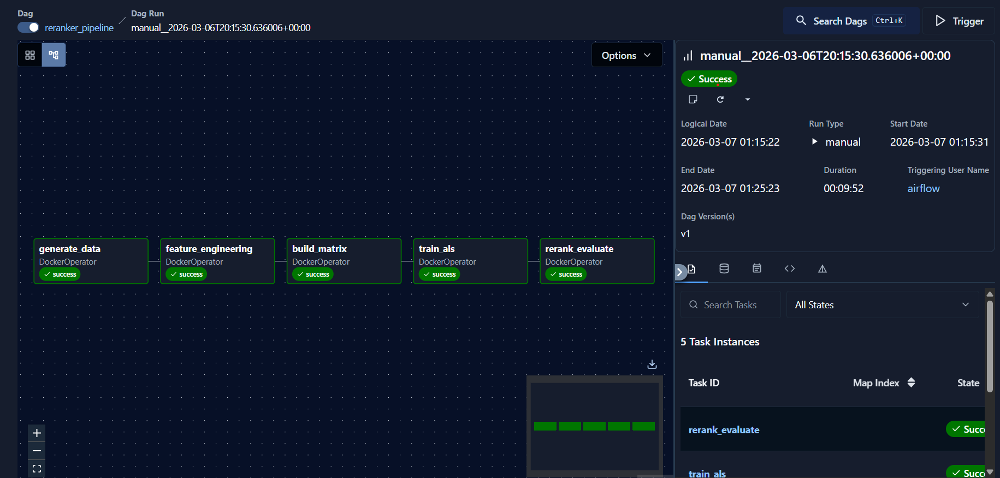

# Step 04 — Automation Pipeline (Airflow + DockerOperator)

**Branch:** `step/04-automation`  
**Input:** All previous step outputs (regenerated each run)  
**Output:** Fresh model + evaluation every run  
**DAG file:** `<your-airflow-docker-dir>/dags/reranker_pipeline.py`

---

## What This Step Does

Wraps the entire pipeline into a single Airflow DAG that runs automatically
on the 1st of every month. Each run regenerates data, re-engineers features,
rebuilds the matrix, retrains ALS, and evaluates — producing a fresh model
from the latest behavioral data.

```
generate_data → feature_engineering → build_matrix → train_als → rerank_evaluate
```

---

## Architecture: Why DockerOperator

Your Airflow runs inside Docker. Your reranker scripts live on your host machine.
DockerOperator bridges this gap cleanly:

```
Airflow Scheduler (inside Docker)
    │
    └── triggers DockerOperator task
            │
            └── spins up python:3.11-slim container
                    │
                    ├── mounts <your-reranker-dir> → /opt/reranker
                    ├── pip installs dependencies
                    ├── runs the script
                    └── container exits and is removed
```

Each task gets its own fresh container. Data persists between tasks because
all scripts read/write to the mounted `/opt/reranker/data/` folder on your
host machine.

---

## One-Time Setup

Before this step works, two changes are required in your `docker-compose.yml`
under the `x-airflow-common` volumes section:

```yaml
# Add these two lines to the volumes section:
- //var/run/docker.sock:/var/run/docker.sock          # lets Airflow talk to Docker daemon
- <your-reranker-dir>:/opt/reranker                   # mounts reranker project into containers

# Update _PIP_ADDITIONAL_REQUIREMENTS:
_PIP_ADDITIONAL_REQUIREMENTS: apache-airflow-providers-docker
```

Replace `<your-reranker-dir>` with the absolute path to your reranker project folder.
On Windows use forward slashes (e.g. `C:/Users/you/projects/reranker`).

After editing, restart Airflow:
```bash
docker-compose down
docker-compose up -d
```

---

## DAG Configuration

| Setting | Value | Why |
|---|---|---|
| `schedule` | `0 0 1 * *` | 1st of every month at midnight |
| `catchup` | `False` | Don't backfill missed runs |
| `max_active_runs` | `1` | Prevent two training runs overlapping |
| `retries` | `1` | Auto-retry once on failure |
| `auto_remove` | `force` | Clean up containers after each task |

---

## How to Deploy

Before deploying, update `HOST_RERANKER_PATH` in the DAG file to match
your local reranker project path:

```python
# reranker_pipeline.py
HOST_RERANKER_PATH = "/absolute/path/to/your/reranker"
```

Then copy the DAG file to your Airflow dags folder:

```
<your-airflow-docker-dir>/dags/reranker_pipeline.py
```

Airflow scans the dags folder every 30 seconds. Within a minute you should
see `reranker_pipeline` appear at `http://localhost:8080`.

---

## How to Trigger Manually

In the Airflow UI at `http://localhost:8080`:

1. Find `reranker_pipeline` in the DAG list
2. Toggle it **ON** (unpaused) using the switch on the left
3. Click the **▶ Trigger DAG** button (play icon on the right)
4. Click into the run to watch tasks execute in the Graph view

Or via CLI:
```bash
docker exec -it <your-airflow-scheduler-container> \
  airflow dags trigger reranker_pipeline
```

---

## Monitoring a Run

In the Graph view you'll see the 5 tasks light up sequentially:

```
[generate_data] → [feature_engineering] → [build_matrix] → [train_als] → [rerank_evaluate]
   ~90s               ~30s                   ~10s             ~15s           ~20s
```

Total runtime: ~3 minutes

Click any task → **Logs** to see the script's stdout output directly in
the Airflow UI — same output you saw when running scripts manually.

---

## What Changes Each Run

Each pipeline run simulates a new month of traffic and appends to existing data:

```
Run 1 (month 1): 50,000 sessions  →  total: 50,000   NDCG@10: ~0.826
Run 2 (month 2): 50,000 sessions  →  total: 100,000  NDCG@10: ?
Run 3 (month 3): 50,000 sessions  →  total: 150,000  NDCG@10: ?
```

More historical data = denser interaction matrix = better embeddings = higher NDCG@K over time.

---

## Checking Results After a Run

After each successful run, check the evaluation output on your host machine:

```python
import json
with open("data/eval/evaluation_summary.json") as f:
    results = json.load(f)

print("Search NDCG@10  :", results["search"]["als"][10])
print("Homepage NDCG@10:", results["homepage"]["als"][10])
```

---

## Troubleshooting

**DAG not appearing in UI**
- Check the file is saved to the correct `dags/` folder
- Check for Python syntax errors: `python reranker_pipeline.py`
- Airflow rescans every 30s — wait a minute

**Task fails with "docker.sock permission denied"**
- Confirm `//var/run/docker.sock:/var/run/docker.sock` is in `docker-compose.yml`
- Restart Docker Desktop and re-run `docker-compose up -d`

**Task fails with "module not found"**
- The pip install runs inside the container — check internet connectivity
- Verify `python:3.11-slim` image is available: `docker pull python:3.11-slim`

**Script fails but ran fine manually**
- Check the mount path — script expects to find data at `/opt/reranker/data/`
- Confirm `HOST_RERANKER_PATH` in the DAG file matches your actual folder path

---

## Project Structure at This Stage

```
<your-reranker-dir>/
├── data/
│   ├── raw/
│   ├── features/
│   ├── matrix/
│   ├── model/
│   └── eval/
└── scripts/
    ├── 01_generate_synthetic_data.py
    ├── 02_feature_engineering.py
    ├── 03a_interaction_matrix.py
    ├── 03b_als_model.py
    └── 03c_rerank.py

<your-airflow-docker-dir>/
└── dags/
    └── reranker_pipeline.py      ← DAG file lives here
```

